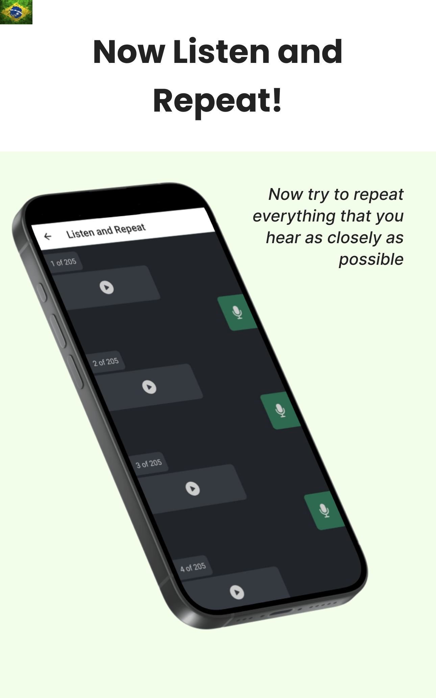

## To run the App
1. Install dependencies

   ```bash
   npm install
   ```

2. Start the app

   ```bash
    npx expo start
   ```

In the output, you'll find options to open the app in a

- [development build](https://docs.expo.dev/develop/development-builds/introduction/)
- [Android emulator](https://docs.expo.dev/workflow/android-studio-emulator/)
- [iOS simulator](https://docs.expo.dev/workflow/ios-simulator/)
- [Expo Go](https://expo.dev/go), a limited sandbox for trying out app development with Expo

### Remember to clone and run the back-end
- [Shadowing-App-python](https://github.com/GabriellBarbosa/Shadowing-App-python)

When you're using the App make sure that you are connected to the same internet connection as the server.